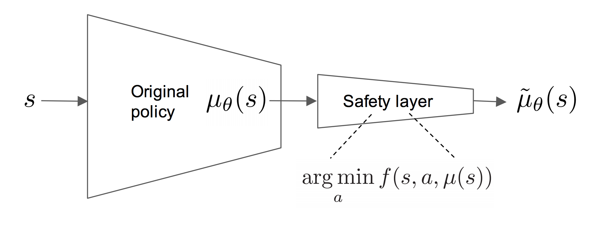

# Safe-Explorer

## Introduction

This repository contains Pytorch implementation of paper ["Safe Exploration in Continuous Action Spaces" [Dalal et al.]](https://arxiv.org/pdf/1801.08757.pdf) along with ["Continuous Control With Deep Reinforcement
Learning" [Lillicrap et al.]](https://arxiv.org/pdf/1509.02971.pdf). Dalal et al. present a closed form analytically optimal solution to ensure safety in continuous action space. The proposed "safety layer",
makes the smallest possible perturbation to the original action such that safety constraints are satisfied.



Dalal et al. also propose two new domains BallND and Spaceship which are governed by first and second order dynamics respectively. In Spaceship domain agent receives a reward only on task completion, while BallND has continuous reward based distance from the target. Implementation of both of these tasks extend OpenAI gym's environment interface (`gym.Env`).

## Setup

The code requires Python 3.6+ and is tested with torch 1.1.0. To install dependencies run,

```sh
pip install -r requirements.txt
```

## Training

To obtain list of parameters and their default values run,

```sh
python -m safe_explorer.main --help
```

Train the model by simply running,

### BallND

```sh
python -m safe_explorer.main --main_trainer_task ballnd
```

### Spaceship

```sh
python -m safe_explorer.main --main_trainer_task spaceship
```

Monitor training with Tensorboard,
```sh
tensorboard --logdir=runs
```

## Results

To be updated.

## Acknowledgement

Some modifications in DDPG implementation are based [OpenAI Spinning Up implement](https://spinningup.openai.com/en/latest/algorithms/ddpg.html).

## References
- Lillicrap, Timothy P., et al. "Continuous control with deep reinforcement learning." arXiv preprint arXiv:1509.02971 (2015).

- Dalal, Gal, et al. "Safe exploration in continuous action spaces." arXiv preprint arXiv:1801.08757 (2018).